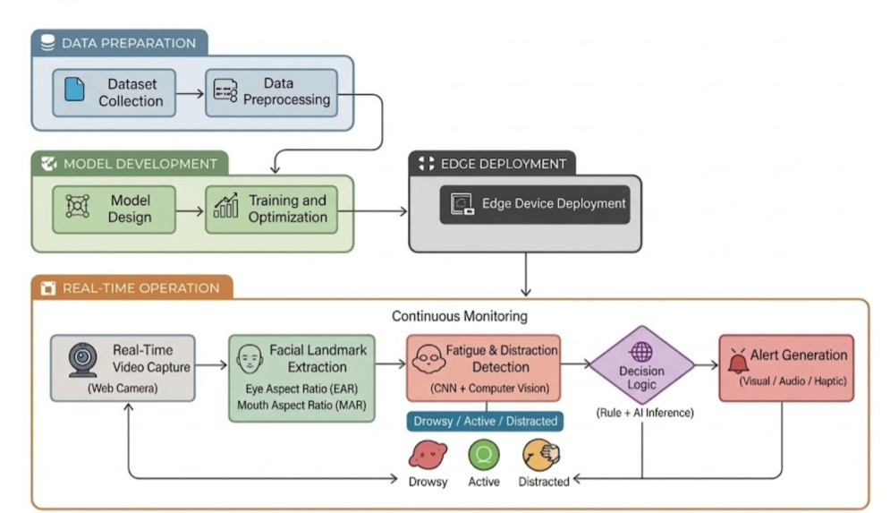
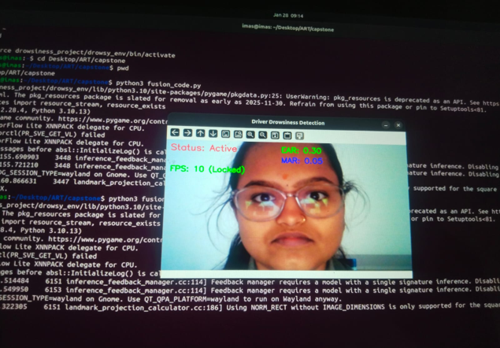
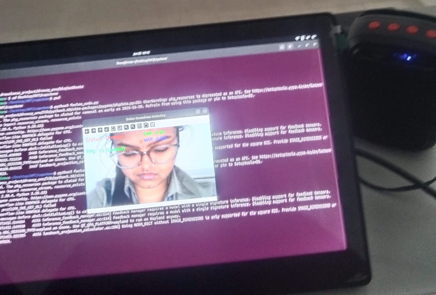
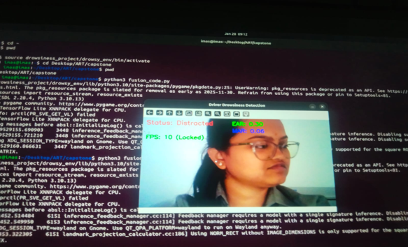

# Vision-Based Driver Drowsiness & Distraction Detection Using Lightweight CNN on Edge Devices

### Real-Time Monitoring using Transfer Learning and Edge-Optimized Inference

---

## 🔍 Motivation & Core Idea

Driver drowsiness and distraction are among the leading causes of road accidents, particularly during long-duration and night-time driving. Many existing solutions rely on intrusive sensors or expensive hardware, limiting their practicality for large-scale deployment.

The core idea of this project is to develop a vision-based driver monitoring system that leverages computer vision and deep learning to detect driver alertness in real time while being lightweight enough to run on edge devices such as Raspberry Pi.

This project emphasizes practical deployment, real-time performance, and efficient edge-device inference rather than focusing solely on model accuracy.

---

## 🎯 Project Objective

- Monitor driver alertness in real time using facial cues.
- Detect and classify driver states as **Active**, **Distracted**, or **Drowsy**.
- Utilize Transfer Learning for efficient model training.
- Optimize inference for edge-device deployment using TensorFlow Lite.
- Integrate visual and audio feedback mechanisms for timely alerts.

---

## ✨ Key Features

- Real-time facial landmark detection using MediaPipe.
- Eye Aspect Ratio (EAR) and Mouth Aspect Ratio (MAR) based behavioural analysis.
- Lightweight CNN based on MobileNetV2.
- Pretrained and optimized TensorFlow Lite (TFLite) model for fast inference.
- Audio alert system to warn the driver during drowsy states.
- Modular architecture enabling easy future enhancements.
- Successfully deployed on Raspberry Pi for edge-based inference.

---

## 🏗️ System Workflow

<p align="center">
  
</p>

The system follows a complete pipeline from data collection and preprocessing to model training, TensorFlow Lite optimization, Raspberry Pi deployment, and real-time driver monitoring. Facial landmarks are extracted using MediaPipe, Eye Aspect Ratio (EAR) and Mouth Aspect Ratio (MAR) are computed, and the CNN model classifies the driver's state before generating visual and audio alerts.

---

## 🧠 Model & Technical Approach

**Model Backbone:** MobileNetV2 (Pretrained on ImageNet)

### Learning Strategy

- Utilizes pretrained feature extraction for edges, textures, and facial patterns.
- Reduces training time and improves generalization on limited data.

### Optimization

- Trained Keras model converted to TensorFlow Lite (TFLite).
- Designed for low-latency inference on edge devices.

### Decision Logic

- CNN-based classification combined with EAR and MAR thresholds for robust driver-state detection.

---

## 🛠️ Technologies Used

### Programming & Frameworks

- Python 3.10
- TensorFlow / Keras
- TensorFlow Lite

### Computer Vision & ML

- OpenCV
- MediaPipe
- Transfer Learning (MobileNetV2)

### Deployment

- Laptop Webcam (Development & Testing)
- Raspberry Pi (Edge Deployment)

---

## ▶️ Running the Project

### 1️⃣ Clone the repository

```bash
git clone https://github.com/kumarthanmayi/Vision-Based-Driver-Drowsiness-Detection.git
cd Vision-Based-Driver-Drowsiness-Detection
```

### 2️⃣ Install dependencies

```bash
pip install opencv-python mediapipe tensorflow numpy pygame
```

### 3️⃣ Run the real-time detection

```bash
python fusion_code.py
```

The system will activate the webcam and display the driver's current state in real time.

> **Note:** The project can be executed directly on a laptop using a webcam for development and testing. For Raspberry Pi deployment, connect the required hardware, install the dependencies on the Raspberry Pi, copy the project files, and then execute the same detection script using the TensorFlow Lite model.

---

## 📸 Project Results

### ✅ Active Driver Detection

<p align="center">
  
</p>

---

### 😴 Drowsiness Detection

<p align="center">
  
</p>

<p align="center">
  
</p>

---

### ⚠️ Distraction Detection

<p align="center">
  
</p>

---

## ⛔ How to Stop Execution

Press **Q** in the OpenCV display window.

---

## 🎓 Key Learnings

- End-to-end development of a real-time vision-based machine learning system.
- Practical application of Transfer Learning in constrained environments.
- Model optimization and conversion for edge devices using TensorFlow Lite.
- Understanding performance trade-offs in real-world deployments.
- Integrating deep learning with classical computer vision techniques.
- Deploying AI models on Raspberry Pi for efficient edge inference.

---

## 🚀 Future Enhancements

- Model quantization and frame-skipping to further reduce latency.
- Multi-threaded inference pipeline for improved throughput.
- Adaptive driver-specific alert thresholds.
- Integration with vehicle systems for automated safety responses.
- Improved robustness under varying lighting conditions.

---

## 🎥 Demonstration

### 💻 Laptop

Live webcam-based real-time detection for development and testing.

### 🍓 Raspberry Pi

The demonstration video showcases the complete deployment and real-time execution of the system on a Raspberry Pi using TensorFlow Lite.

**Demo Video:**

https://github.com/user-attachments/assets/245a31f6-9afe-4316-8eaa-1801b2dfd7b1


---

## 📝 Final Note

This project includes a pretrained, edge-optimized TensorFlow Lite model, enabling immediate real-time inference without retraining.

The source code can be executed on a laptop using a webcam for testing purposes, while the complete edge deployment demonstrated in this repository has been successfully implemented on a Raspberry Pi.

The project focuses on practical applicability, system integration, and deployment readiness, making it suitable for real-world intelligent transportation systems.
